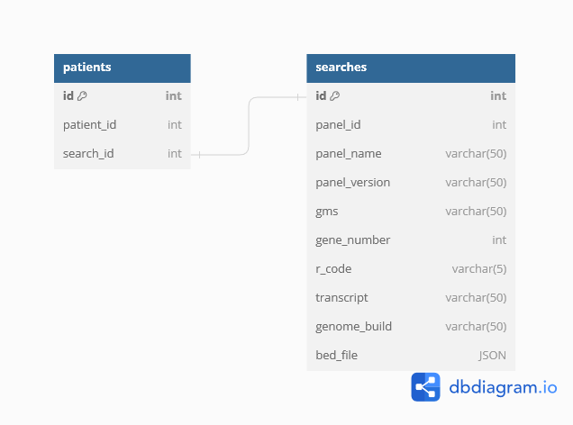

SQL Database
============

*WARNING: Please ask Isabel to turn on the cloud-based SQL database before attempting to run code. Alternatively, use MySQL Workbench to manually create a database and modify the code to run locally.*

The SQL database is hosted on the cloud and is already created for you. However, there is an option for local/Docker use which means that the SQL database needs to be created manually. The database stores information about the search.

One table is called patients and stores the patient ID and search ID.

The other table is called searches and holds the search information generated. This includes the panel ID, panel name, panel version, GMS signed-off status, gene names, R code of panels, MANE select transcripts, genome build, and BED file as a JSON.

